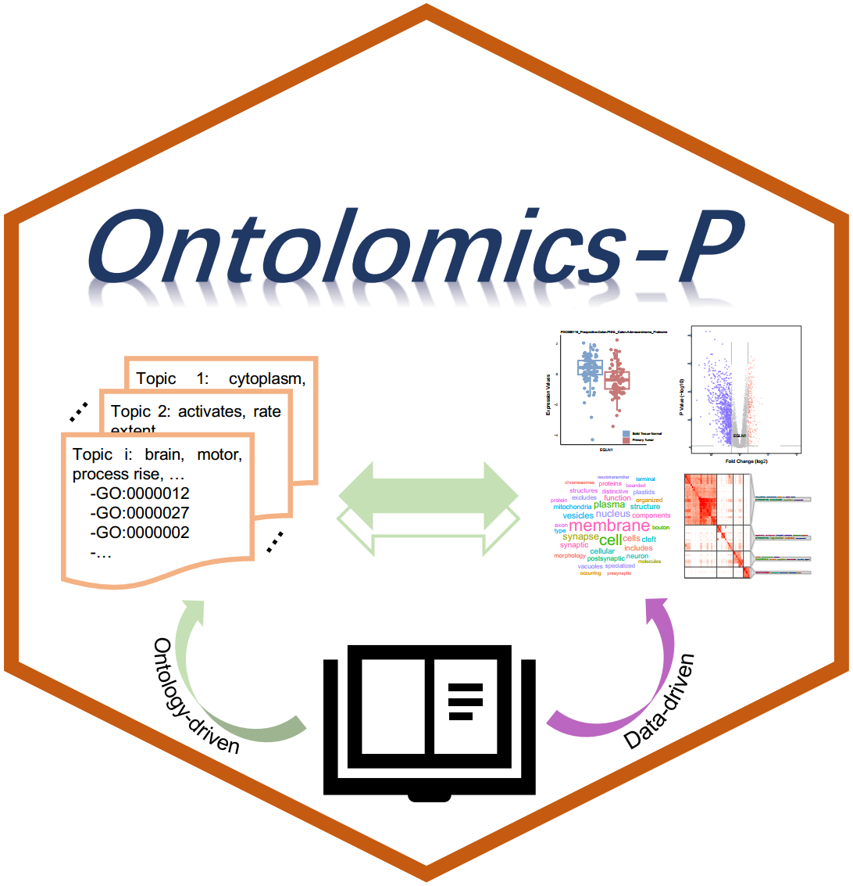
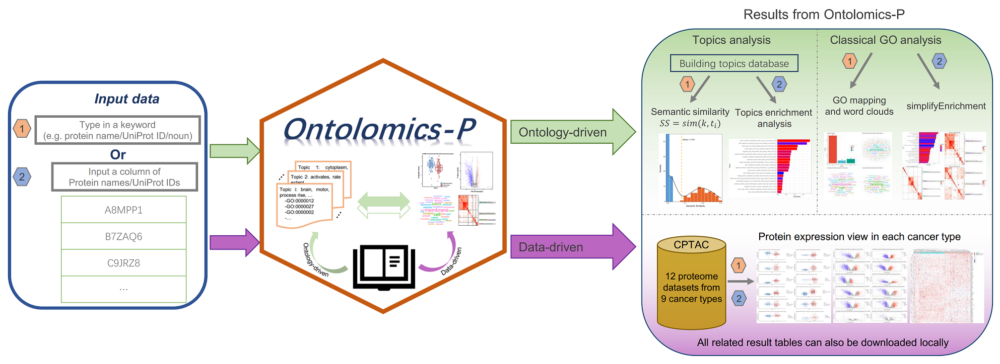
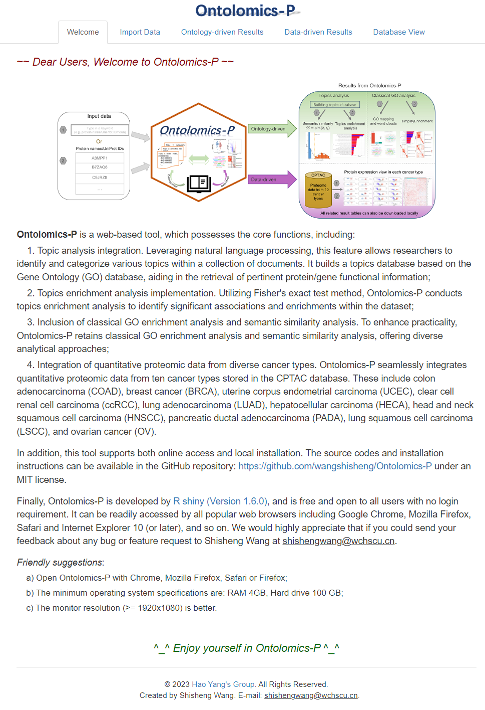

# PTMoreR
Ontolomics-P: ontology guide and data-driven analysis of mass spectrometry-based proteomics data

## Brief Description
**<font size='5'> Ontolomics-P </font>** is a web-based and stand-alone tool for stands out as a versatile tool tailored for the proteomics community, 
featuring a graphical user interface (GUI) to facilitate the analysis of MS-based proteomics data from ontology-driven and data-driven perspectives. This comprehensive tool incorporates four essential functions. Firstly, 
its Topic Analysis Integration employs natural language processing to categorize topics within a document collection, building a topics database based on the Gene Ontology (GO) database for efficient retrieval of protein/gene 
functional information. Secondly, Ontolomics-P implements topics enrichment analysis using Fisher's exact test method to identify significant associations and enrichments within the dataset. Thirdly, it includes classical GO 
enrichment analysis and semantic similarity analysis for diverse analytical approaches. Lastly, the tool seamlessly integrates quantitative proteomic data from ten cancer types stored in the CPTAC database, facilitating the 
efficient review of Profiles of Interest (POI) expression profiles in colon adenocarcinoma (COAD) [1], breast cancer (BRCA) [2], uterine corpus endometrial carcinoma (UCEC) [3], clear cell renal cell carcinoma (ccRCC) [4], 
lung adenocarcinoma (LUAD) [5], hepatocellular carcinoma (HECA) [6], head and neck squamous cell carcinoma (HNSCC) [7], pancreatic ductal adenocarcinoma (PADA) [8], lung squamous cell carcinoma (LSCC) [9], and ovarian cancer (OV) [10]. 
This software (online version) is available here: [https://www.omicsolution.com/wukong/Ontolomics-P](https://www.omicsolution.com/wukong/Ontolomics-P). **Please note**: If the data are too large, we recommend users to intall this tool locally. 
Local installation can be found below.

## Graphical Abstract


## How to use
A detailed introduction of this software can be found in the [Supplementary Notes](https://github.com/wangshisheng/Ontolomics-P/blob/master/SupplementaryNotes.pdf).

## Run it locally
This tool is developed with R, so if you want to run it locally, you may do some preparatory work:  
**1. Install R.** You can download R from here: [https://www.r-project.org/](https://www.r-project.org/).  
**2. Install RStudio.** (Recommendatory but not necessary). You can download RStudio from here: [https://www.rstudio.com/](https://www.rstudio.com/).  
**3. Check packages.** After installing R and RStudio, you should check whether you have installed these packages (devtools, shiny, shinyjs, shinyWidgets, shinyBS, DT, data.table, ggsci, ggplot2, ggrepel, patchwork, dplyr, GOSemSim, openxlsx, clusterProfiler, simplifyEnrichment, tidytext, ggwordcloud, cowplot, grid, ggpubr, impute, pheatmap, ggplotify, limma, qvalue). You may run the codes below to check them:  

```r
if(!require(pacman)) install.packages("pacman")
pacman::p_load(devtools, shiny, shinyjs, shinyWidgets, shinyBS, DT, data.table, ggsci, ggplot2, ggrepel, patchwork, dplyr, GOSemSim, openxlsx, clusterProfiler, simplifyEnrichment, tidytext, ggwordcloud, cowplot, grid, ggpubr, impute, pheatmap, ggplotify, limma, qvalue)
```

If the preparatory work has been done, you can run this tool locally as below:
```r
if(!require(PTMoreR)) devtools::install_github("wangshisheng/Ontolomics-P")
library(Ontolomics-P)
Ontolomics-P_app()
```

**Please note**, as there are many databases from different species, this package is large. If you have some issues when you install it using the code above, _please try download it into your own computer and install locally_. And please also feel free to write an issue or e-mail to me if you have any problem about this software.

Then motifeR will be started as below:

<br>

## Friendly suggestions
1. Open PTMoreR with Chrome, Mozilla Firefox, Safari or Firefox.
2. The minimum operating system specifications are: **RAM 4GB, Hard drive 500 GB.**
3. The monitor resolution (>= 1920x1080) is better.

## Contact
You could push an issue on this github. And optionally, please feel free to sent me an e-mail if you have any question or find a bug about this tool. Thank you^_^
Email: shishengwang@wchscu.cn.


